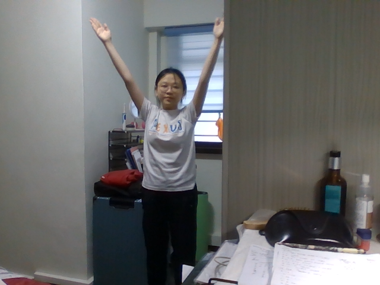
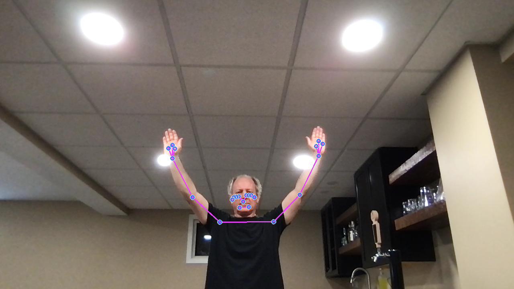

# Using MediaPipe to detect YMCA dance moves

This repo contains the code used to re-create the 70's dance craze 'YMCA' by 'The Village People'.

[Village People - YMCA Official Music Video](https://www.youtube.com/watch?v=CS9OO0S5w2k)

Using the MediaPipe pose detection models, train a custom model to recognize the Y, M, C and A poses from the 70s YMCA song.


## Quick Start Setup (MacOS)

When starting the pose predictions script for the first time, it might take 10-15 seconds to startup as it loads the necessarly libraries.  Subsequent executions will start faster.

```shell
git clone https://github.com/youngsoul/mediapipe-ymca.git
cd mediapipe-ymca
python3 -m venv venv
source venv/bin/activate
pip install -r requirements.txt
python 03_pose_predictions.py
```

Here are some examples of the iconic dance poses.

### Y




### M


### C


### A


## Approach

* Capture many examples of the different poses  using MediaPipe pose models

* Save the x,y,z coordinates of the arms and wrists for each pose to a csv file


### Machine Learning Process

Below is a picture of the general flow of the Machine Learning Process


Sample captured data

```text

Y,0.56172812,0.771587431,-0.162251949,0.436373323,0.765287519,-0.192958564,0.597814322,0.907481551,-0.184370488,0.379148483,0.898177743,-0.22038582,0.626989663,1.00224638,-0.325642794,0.382508397,1.03627193,-0.322546929
M,0.51095444,0.663993299,-0.201380163,0.359371543,0.630927444,-0.195634276,0.618140161,0.616139412,-0.489198864,0.244325727,0.565191627,-0.416401088,0.538030505,0.513025522,-0.688249707,0.345781505,0.497372001,-0.52709347
C,0.496228456,0.824961543,0.19761689,0.410268366,0.686588943,-0.022002202,0.570238709,0.910106003,0.292604834,0.450379699,0.538195908,-0.218064994,0.675926566,0.884340048,0.209622055,0.568691671,0.470013976,-0.185098737
A,0.553130507,0.693015635,-0.032471493,0.413801014,0.693384886,0.074506953,0.547524154,0.479360789,-0.261273533,0.369565457,0.517181873,-0.064564958,0.476920903,0.285808414,-0.360868335,0.427562892,0.305341274,-0.09409456
dance,0.611475766,0.389867514,-0.112690762,0.412283182,0.391914904,-0.052637506,0.68566817,0.658067942,-0.232953832,0.357224882,0.643335521,0.003725914,0.598308921,0.61629492,-0.590728581,0.327875674,0.847303748,-0.189069256

```

* Train a SciKit-Learn model on the training data

* In real-time predict the pose.

## Bonus

While dancing to the YMCA is always fun, it is more fun with additional dancers.  So to create some 'virtual' village people I added an option to add additional dancers.

## Jupyter Notebooks

For more detail on the approach see the Jupyter Notebooks

## Setup

### Install Libraries

`see setup.py`

```shell
pip install -r requirements.txt
```

## Making Predictions

It is always more fun to have the music to dance to.  In the `media` directory I have a short clip of the YMCA song to you dance to.

* Example 1

No parameters meaning the script will take all the default parameters

```shell
python 03_pose_predictions.py 
```

* Example 2

remove pose from main person and add dancers
```shell
python 03_pose_predictions.py --add-dancers --suppress-landmarks
```

## Collecting Pose Data

The script `01_pose_training_data.py` will capture frames from the webcam feed and collect the pose landmarks of interest.  With these values the script will save the x,y,z values to a CSV file with the specified label.

Once all of the poses are collected you can then use the csv datafile for machine learning

* Example 1

This command line will capture frames and store the landmarks with the label 'Y'.  It will collect frames for 20 seconds and will wait 10 seconds before starting to collect frames.  The data will be appended to a file called, 'my_pose_data.csv'
```shell
python 01_pose_training_data.py --class-name Y --collect-for 20 --start-delay 10 --file-name my_pose_data.csv
```

* Example 2

This command is similar to the one above but with the addition of --dry-run which will prevent the data from being written to the data file.
```shell
python 01_pose_training_data.py --class-name Y --collect-for 20 --start-delay 10 --dry-run
```

## Train Models

The script `02_pose_model_training.py` will run through a number of scikit-learn models to determine which model performs the best and then will save that model to a pickle file.  This file is then used to make predictions

* Example 1

with no parameters this script will look for a file named, `./data/ymca_training.csv` and save the model to the name `best_ymca_pose_model.pkl`

```shell
python 02_pose_model_training.py 
```

* Example 2

Parameters allow the defaults to be changed.

```shell
python 02_pose_model_training.py --file-name my_pose_training.csv --model-name my_pose_model
```


