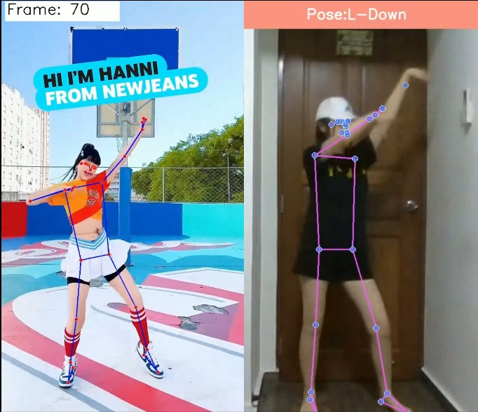

## DanceVision – AI-driven Dance Proficiency Assessment

Snippet of Demo:

*Left video: Song - Super Shy, Dancer - Hanni from KPop Group "New Jeans"*

[Click here to view the entire video](https://youtu.be/zm7Q1nqbS8U)

## Background

With the advent of technology, the way we perceive and interact with dance has evolved. The project at hand aims to leverage the power of machine learning and MediaPipe to detect and analyze dance poses, thereby determining the proficiency of a dancer. This technology can be utilized in various ways, such as an AI dance trainer, a tool for auditions, talent scouting, and entertainment.

#### Problem Statement
There is a need for a more efficient, objective, and accessible method of evaluating dance performance. This project aims to address these challenges by developing a machine learning model that can accurately detect and analyze dance poses. The model will compare a dancer's poses with those of a professional dancer, providing an objective assessment of their performance.

## Approach
Users will select keypoint poses that they wish to evaluate in dance videos by professional dancers. Then, poses from the selected points will be passed into the models for training and each pose will be evaluated separately. Feedback is given in the form of colour indicators as the user dances.

To reduce noise, 12 landmarks are chosen for the upper and lower limbs, with only x and y data points collected, with a total of 24 features extracted per datapoint/frame.

In the song "Super Shy", 10 poses across the 27 seconds choreography video were selected. To ensure that we get enough data for each pose, all information within an range of about 5-20 frames are collected, and this is done over 4 videos of the same dance choregraphy by other members of the same KPop group.   

For each pose, the collected data are trained on 8 models for binary class classification modeling, with hyperparameter tuning using GridSearchCV to obtain the optimal model. 

The table below shows the aggregate scores of the top performing models. Do note that each pose may have a different optimal model.

During video analysis, coloured indicators will be shown during selected/keypoint poses, which can be played back for the users to identify the areas of improvements. For instance: green - high accuracy, yellow - Can be improved, red - wrong pose

<table>
  <tr>
    <td></td>
    <td></td>
    <td></td>
  </tr>
</table>

## Conclusion

#### Limitations
- Ideally, the videos collected need to start at the same timing for the consistency of pose collected at the same timeframe across videos, this limits the number of videos we can use for training. However, this will not be an issue if an entertainment company decides to prepare their own choreography for audition assessement. 
- There are lagging issues between the audio and camera feed, resulting in realtime analysis of poses with music hard to achieve.
- Videos are laggy on free app hosting services like Streamlit, which is not desirable for realtime feedback as well. 

#### Use cases
- Streamline assessment platforms
- Supplementary training tool for dance academies
- Online Scouting

### Future Work
- [ ] Deploy on web app - allow users to upload file of the pretrained song
- [ ] Enable playback function to identify weak dance movements
- [ ] Expand song database
- [ ] Enable user selection of keypoints in a video and carry out live model training  

